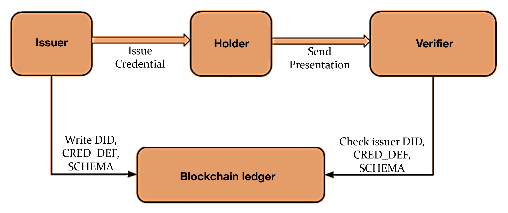
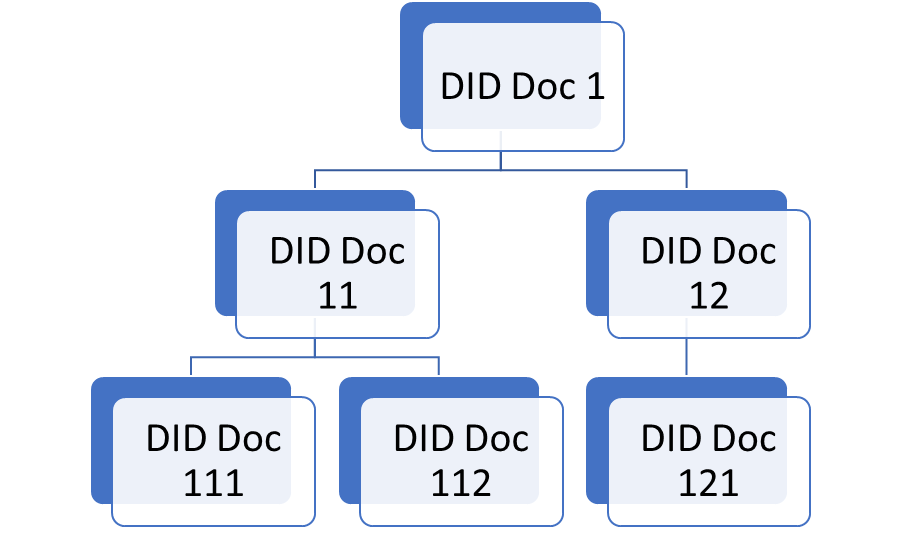
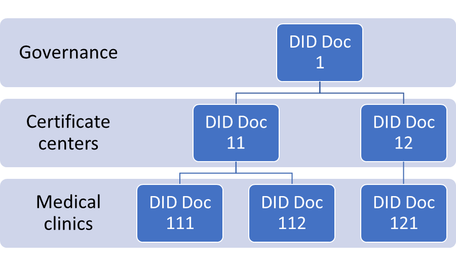
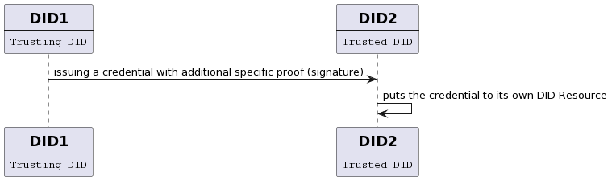
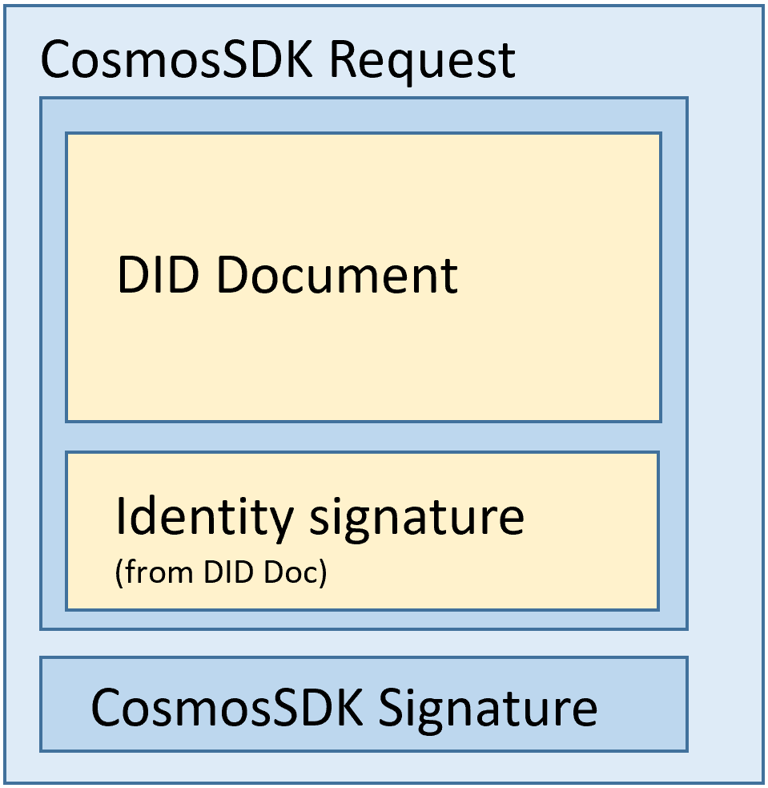

# Canow DID method

| Category              | Status                                                                                   |
|-----------------------|------------------------------------------------------------------------------------------|
| Document type         | Specification                                                                            |
| Authors               | Kunihiro Katsuragi, Mathias Glintborg, Houssein Diab, Renata Toktar, Alexander Sherbakov |
| Stage                 | Draft                                                                                    |
| Implementation Status | Not implemented                                                                          |
| Start Date            | 2022-11-03                                                                               |
| Last Updated          | 2022-11-28                                                                               |

## Summary

This document describes **Canow DID Method (did:canow)**, entities, transactions and more. Not only are we talking about the data structure here, but also about the features of data storage in scalable, performant and interoperable Canow ledger.

Due to the use of the **CosmosSDK** framework, Canow Network has **Proof-of-Stake** protocol with a flexible and reliable payment system.
At the same time, thanks to **Tendermint** framework, the speed and reliability of the network is much higher than that of many other systems with PBFT consensus protocols. In addition, the Tendermint framework used in CosmosSDK is tailored to the network architecture with secure validator nodes, which can significantly increase network fault tolerance. The network capacity can **exceed 200 validators** and an unlimited number of observers. More in the section Privacy and Security Considerations

In addition, Canow DID Method supports multiple Verifiable Credential types, including **CL Anoncreds** (Cheqd DID Resource Module integration) and **BBS+** (Aries Framework integration). This allows the ledger to be used as a verifiable data registry for most SSI flows. More in the section Verifiable credentials

However, Canow also offers innovative ideas in familiar SSI concepts, such as **DID Documents linked by a chain of trust** similar to the CAs concept. The verifier will no longer have to have personal trust to the issuer, it will be enough to trust at least one of the issuers higher up the trust chain. More in the section Linked DID Documents

To tell more, Canow DID Method supports DIDComm Messaging V2 which makes possible using Canow Ledger for [Aries](https://github.com/hyperledger/aries-rfcs/tree/main/concepts/0302-aries-interop-profile) and [WACI](https://identity.foundation/waci-presentation-exchange/) protocols. It allows Canow to be compatible with both well-known interoperable standards.

## DID Syntax

| parameter          | value                                                   |
|--------------------|---------------------------------------------------------|
| did                | “did:” method-name “:” namespace “:” method-specific-id |
| method-name        | “canow”                                                 |
| namespace          | “testnet”                                               |
| method-specific-id | indy-id / UUID                                          |
| indy-id            | Base58(Truncate_msb(16(SHA256(publicKey))))             |

## DID URL Syntax

DID URL can be used to retrieve things like representations of [DID subjects](https://www.w3.org/TR/did-core/#dfn-did-subjects), [verification methods](#verification-method), [services](#services), specific parts of a [DID document](https://www.w3.org/TR/did-core/#dfn-did-documents), or other resources.

`did-url = did path-abempty [ "?" query ] [ "#" fragment ]`

### Path

Resources

- `/1.0/identifiers/{did}/resources/{resourceId}` - Get resource value without dereferencing wrappers. Parameters:
  - **did** (required, path, string) - Resource collection id. DID Doc Id. *Example : "did:canow:testnet:*SEp33q43PsdP7nDATyySSH*"*
    - **resourceId** (required, path, string) - DID Resource identifier. *Example : "60ad67be-b65b-40b8-b2f4-3923141ef382"*
- `/1.0/identifiers/{did}/resources/{resourceId}/metadata` - Get resource metadata without value by DID Doc. Parameters:
  - **did** (required, path, string) - Resource collection id. DID Doc Id. *Example : "did:canow:testnet:*SEp33q43PsdP7nDATyySSH*"*
    - **resourceId** (required, path, string) - DID Resource identifier. *Example : "60ad67be-b65b-40b8-b2f4-3923141ef382"*
- `/1.0/identifiers/{did}/resources/all` - Get a list of all collection resources metadata. Parameters:
  - **did** (required, path, string) - DID Doc Id. *Example : "did:canow:testnet:*SEp33q43PsdP7nDATyySSH*"*

### Query

Dereferencing of [Primary](https://w3c-ccg.github.io/did-resolution/#dereferencing-algorithm-primary) and [Secondary](https://w3c-ccg.github.io/did-resolution/#dereferencing-algorithm-secondary) Resources according [DID Resolution specification](https://w3c-ccg.github.io/did-resolution/). Not to be confused with DID Resource entities.

Example of DID URL for a Primary Resource (Service Endpoint): `did:canow:testnet:5nDyJVP1NrcPAttP3xwMB9?service=files&relativeRef=%2Fmyresume%2Fdoc%3Fversion%3Dlatest`

Example of DID URL for a Secondary Resource (DID fragment): `did:canow:testnet:5nDyJVP1NrcPAttP3xwMB9#public-key-0`

## DID Document properties

1. **@context** (optional): A list of strings with links or JSONs for describing specifications that this DID Document is following to.
2. **id**: Target DID with canow DID Method prefix `did:canow:<namespace>:` and a unique-id identifier.
3. **controller** (optional): A list of fully qualified DID strings or one string. Contains one or more DIDs who can update this DIDdoc. All DIDs must exist.
4. **verificationMethod** (optional): A list of [Verification Methods](#verification-method)
5. **authentication** (optional): A set of either [Verification Methods](#verification-method) or strings with Verification Method IDs (DID URL)
6. **assertionMethod** (optional): A set of either [Verification Methods](#verification-method) or strings with Verification Method IDs (DID URL)
7. **capabilityInvocation** (optional): A set of either [Verification Methods](#verification-method) or strings with Verification Method IDs (DID URL)
8. **capabilityDelegation** (optional): A set of either [Verification Methods](#verification-method) or strings with Verification Method IDs (DID URL)
9. **keyAgreement** (optional): A set of either [Verification Methods](#verification-method) or strings with Verification Method IDs (DID URL)
10. **service** (optional): A list of [Services](#services)
11. **alsoKnownAs** (optional): A list of strings. A DID subject can have multiple identifiers for different purposes, or at different times. The assertion that two or more DIDs refer to the same DID subject can be made using the `alsoKnownAs` property.

Example of DIDDoc representation:

```json
{
   "@context":[
      "https://www.w3.org/ns/did/v1",
      "https://w3id.org/security/suites/ed25519-2020/v1"
   ],
   "id":"did:canow:testnet:SEp33q43PsdP7nDATyySSH",
   "verificationMethod":[
      {
         "id":"did:canow:testnet:SEp33q43PsdP7nDATyySSH#authKey1",
         "type":"Ed25519VerificationKey2020",
         "controller":"did:canow:testnet:N22SEp33q43PsdP7nDATyySSH",
         "publicKeyMultibase":"zAKJP3f7BD6W4iWEQ9jwndVTCBq8ua2Utt8EEjJ6Vxsf"
      },
      {
         "id":"did:canow:testnet:SEp33q43PsdP7nDATyySSH#capabilityInvocationKey",
         "type":"Ed25519VerificationKey2020",
         "controller":"did:canow:testnet:N22SEp33q43PsdP7nDATyySSH",
         "publicKeyMultibase":"z4BWwfeqdp1obQptLLMvPNgBw48p7og1ie6Hf9p5nTpNN"
      }
   ],
   "authentication":[
      "did:canow:testnet:SEp33q43PsdP7nDATyySSH#authKey1"
   ],
   "capabilityInvocation":[
      "did:canow:testnet:SEp33q43PsdP7nDATyySSH#capabilityInvocationKey"
   ]
}
```

### Services

Services can be defined in a DIDDoc to express means of communicating with the DID subject or associated entities.

1. **id** (string): The value of the id property for a Service MUST be a URI conforming to [RFC3986](https://www.rfc-editor.org/rfc/rfc3986). A conforming producer MUST NOT produce multiple service entries with the same ID. A conforming consumer MUST produce an error if it detects multiple service entries with the same ID. It has a follow formats: `did:canow:<namespace>:<id>#<service-alias>` or `#<service-alias>`.
2. **type** (string): The service type and its associated properties SHOULD be registered in the [DID Specification Registries](https://www.w3.org/TR/did-spec-registries/)
3. **serviceEndpoint** (strings): A string that conforms to the rules of [RFC3986](https://www.rfc-editor.org/rfc/rfc3986) for URIs, a map, or a set composed of a one or more strings that conform to the rules of [RFC3986](https://www.rfc-editor.org/rfc/rfc3986) for URIs and/or maps.
4. **accept** ([string], optional): An array of media types in the order of preference for sending a message to the endpoint. These identify a *profile* of DIDComm Messaging that the endpoint supports.
5. **routingKeys** ([string], optional): An ordered array of strings referencing keys to be used when preparing the message for transmission as specified in [Sender Process to Enable Forwarding](https://identity.foundation/didcomm-messaging/spec/#sender-process-to-enable-forwarding), above.

Example of Service in a DIDDoc:

```json
{
   "id":"did:canow:testnet:SEp33q43PsdP7nDATyySSH#linked-domain",
   "type":"LinkedDomains",
   "serviceEndpoint":"https://bar.example.com"
}
```

```json
{
  "id":"did:canow:testnet:SEp33q43PsdP7nDATyySSH#didcom-agent",
  "type":"DIDCommMessaging",
  "serviceEndpoint":"http://example.com/path",
  "accept":[
      "didcomm/v2",
      "didcomm/aip2;env=rfc587"
  ],
  "routingKeys":[
      "did:example:somemediator#somekey"
  ]
}
```

### Verification Method

Verification methods are used to define how to authenticate / authorise interactions with a DID subject or delegates. Verification method is an OPTIONAL property.

1. **id** (string): A string with a format `did:canow:<namespace>:<id>#<key-alias>` or `#<key-alias>`
2. **controller**: A string with fully qualified DID. DID must exist.
3. **type** (string)
4. **publicKeyJwk** (map[string,string], optional): A map representing a JSON Web Key that conforms to [RFC7517](https://tools.ietf.org/html/rfc7517). See definition of publicKeyJwk for additional constraints.
5. **publicKeyMultibase** (string, optional): A base58-encoded string that conforms to a [MULTIBASE](https://datatracker.ietf.org/doc/html/draft-multiformats-multibase-03) encoded public key.

**Note**: A single verification method entry cannot contain both publicKeyJwk and publicKeyMultibase, but must contain at least one of them.

Example of Verification method in a DIDDoc

```json
{
   "id":"did:canow:testnet:SEp33q43PsdP7nDATyySSH#key-0",
   "type":"JsonWebKey2020",
   "controller":"did:canow:testnet:SEp33q43PsdP7nDATyySSH",
   "publicKeyJwk":{
      "kty":"OKP",
      "crv":"Ed25519",
      "x":"VCpo2LMLhn6iWku8MKvSLg2ZAoC-nlOyPVQaO3FxVeQ"
   }
}
```

### DID Document metadata

Each DID Document MUST have a metadata section when a representation is produced. It can have the following properties:

1. **created** (string): Formatted as an XML Datetime normalized to UTC 00:00:00 and without sub-second decimal precision, e.g., 2020-12-20T19:17:47Z.
2. **updated** (string): The value of the property MUST follow the same formatting rules as the created property. The updated field is null if an Update operation has never been performed on the DID document. If an updated property exists, it can be the same value as the created property when the difference between the two timestamps is less than one second.
3. **deactivated** (string): If DID has been deactivated, DID document metadata MUST include this property with the boolean value true. By default this is set to false.
4. **versionId** (string): Contains transaction hash of the current DIDDoc version.
5. **linkedResourceMetadata** (list of resources metadata referred to as [Resource previews](https://github.com/cheqd/node-docs/blob/main/architecture/adr-list/adr-008-ledger-resources.md)| *optional*). Cannot be changed by CreateDID or UpdateDID transactions. canow ledger stores only the resource identifiers in the DID Doc metadata. The remainder of the resources' metadata is added when a DID is resolved.

Example of DIDDoc metadata:

```json
{
   "created":"2020-12-20T19:17:47Z",
   "updated":"2020-12-20T19:19:47Z",
   "deactivated":false,
   "versionId":"1B3B00849B4D50E8FCCF50193E35FD6CA5FD4686ED6AD8F847AC8C5E466CFD3E",
   "linkedResourceMetadata":[
      {
         "resourceURI":"did:canow:testnet:SEp33q43PsdP7nDATyySSH/resources/9cc97dc8-ab3a-4a2e-a18a-13f5a54e9096",
         "resourceCollectionId":"SEp33q43PsdP7nDATyySSH",
         "resourceId":"9cc97dc8-ab3a-4a2e-a18a-13f5a54e9096",
         "resourceName":"PassportSchema",
         "resourceType":"CL-Schema",
         "mediaType":"application/json",
         "created":"2022-04-20T20:19:19Z",
         "checksum":"a7c369ee9da8b25a2d6e93973fa8ca939b75abb6c39799d879a929ebea1adc0a",
         "previousVersionId":null,
         "nextVersionId":null
      }
   ]
}
```

## DID Resources

It is associated with DID Document bytes data with specific Resource metadata. More details in [ADR 008: On-ledger Resources with DID URLs](https://github.com/cheqd/node-docs/blob/main/architecture/adr-list/adr-008-ledger-resources.md). DID Resource properties:

- **ResourceMetadata**
  - **Resource Collection ID:** an identifier of a “parent” DID Document without `did:canow:testnet:` prefix;
    - **Resource ID:** UUID specific to resource, also effectively a version number;
    - **Resource Name:** a client defined name of a resource;
    - **Resource Type:** a client defined type of resource in a string format without any enum values;
    - **MediaType:** (e.g. `application/json`/`image`/`application/octet-stream`/`text/plain`) resource data MediaType(Content type) computed on a ledger-side;
    - **Created:** XMLDatetime of DID Resource creation;
    - **Checksum:** SHA-256 resource data checksum;
    - **previousVersionId:** `null` if first, otherwise ID as long as Name, ResourceType match previous version;
    - **nextVersionId:** `null` if first/latest, otherwise ID as long as Name, ResourceType match next version;
- **resourceData:** resource data in bytes format. On the ledger side and in resolutions is usually presented separately.

**Resource example:**

```jsonc
{
 "resourceMetadata": {
     "resourceCollectionId":      "DAzMQo4MDMxCjgwM",
     "resourceId":                "bb2118f3-5e55-4510-b420-33ef9e1726d2",
     "resourceName":              "PassportSchema",
     "resourceType":              "CL-Schema",
     "mediaType":                 "application/json",
     "created":                   "2022-04-20T20:19:19Z",
     "checksum":                  "a7c369ee9da8b25a2d6e93973fa8ca939b75abb6c39799d879a929ebea1adc0a",
     "previousVersionId":         null,
     "nextVersionId":             null
 },
 "resourceData": <"test_data" in bytes>
}
```

## Verifiable credentials

### CL AnonCreds

CL Anonymous Credentials [[spec](https://hyperledger.github.io/anoncreds-spec/)] is a type of Verifiable credentials where [CL signatures](https://eprint.iacr.org/2012/562.pdf) is used for generating a proof. CL AnonCreds provide such features as selective disclosure and predicates support. This type of Verifiable credentials is used in Indy ecosystem.

For supporting CL Anoncreds, Schema and Credential definition(Cred_def) entities must be stored in a Verifiable Data registry (such as Blockchain Ledger).  DID Resources can be used for this.



**Example of CL Schema in DID Resource:**

```json
{
 "resourceMetadata": {
     "resourceCollectionId":      "DAzMQo4MDMxCjgwM",
     "resourceId":                "bb2118f3-5e55-4510-b420-33ef9e1726d2",
     "resourceName":              "PassportSchema",
     "resourceType":              "CL-Schema",
     "mediaType":                 "application/json",
     "created":                   "2022-04-20T20:19:19Z",
     "checksum":                  "a7c369ee9da8b25a2d6e93973fa8ca939b75abb6c39799d879a929ebea1adc0a",
     "previousVersionId":         null,
     "nextVersionId":             null
 },
 "resourceData": {"attrNames":["name","age","sex"]}
}
```

**Example of CL Credential Definition in DID Resource:**

```json
{
 "resourceMetadata": {
     "resourceCollectionId":      "DAzMQo4MDMxCjgwM",
     "resourceId":                "92f5ed06-0489-44e0-9215-99851654b610",
     "resourceName":              "PassportCredentialDefinition",
     "resourceType":              "CL-CredDef",
     "mediaType":                 "application/json",
     "created":                   "2022-04-20T21:10:10Z",
     "checksum":                  "a5abed82596e023395d0bb0c30516e78bd5eee7131245d94e54b38ab67c924e5",
     "previousVersionId":         null,
     "nextVersionId":             null
 },
 "resourceData": {
    "primary": {
          "n": "779...397",
          "r": {
            "birthdate": "294...298",
            "birthlocation": "533...284",
            "citizenship": "894...102",
            "expiry_date": "650...011",
            "facephoto": "870...274",
            "firstname": "656...226",
            "link_secret": "521...922",
            "name": "410...200",
            "uuid": "226...757"
         },
         "rctxt": "774...977",
         "s": "750..893",
         "z": "632...005"
    }
 }
}
```

### BBS+ signature

[BBS+ signature](https://www.ietf.org/archive/id/draft-irtf-cfrg-bbs-signatures-02.html) is an alternative to [CL signature](https://eprint.iacr.org/2012/562.pdf) in SSI world. It is a new modern flow that supports selective disclosure and hence can be used instead of CL Anoncreds in many cases.

BBS signature is stored in DID Doc [[spec](https://www.w3.org/TR/did-core/#core-properties)] as a [Verification method](#verification-method) (`publicKeyMultibase` or `publicKeyJwk`) in **[Assertion](https://www.w3.org/TR/did-core/#assertion)** section.

****Example:****

```jsonc
{
  "@context": [
    "https://www.w3.org/ns/did/v1",
    ...
  ],
  "id": "did:canow:testnet:123456789abcdefghi",
 ...
  "authentication": [
  {
    "id": "did:canow:testnet:123456789abcdefghi#key-1",
    "type": "Bls12381G1Key2020",
    "controller": "did:canow:testnet:123",
    "publicKeyJwk": {
      "kty": "EC",
      "crv": "BLS12381_G1",
      "x": "tCgCNuUYQotPEsrljWi-lIRIPpzhqsnJV1NPnE7je6glUb-FJm9IYkuv2hbHw22i"
    }
  },
  {
    "id": "did:canow:testnet:123456789abcdefghi#key-2",
    "type": "Bls12381G2Key2020",
    "controller": "did:canow:testnet:123",
   "publicKeyJwk": {
       "crv": "BLS12381_G2",
       "kty": "EC",
       "x": "h_rkcTKXXzRbOPr9UxSfegCbid2U_cVNXQUaKeGF7UhwrMJFP70uMH0VQ9-3-_2zDPAAjflsdeLkOXW3-ShktLxuPy8UlXSNgKNmkfb-rrj-FRwbs13pv_WsIf-eV66-"
     }
  }
  ],
}
```

## ****DIDComm V2 support****

The purpose of DIDComm Messaging is to provide a secure, private communication methodology built atop the decentralized design of [DIDs](https://www.w3.org/TR/did-core/).

> DIDComm Messaging uses public key cryptography, not certificates from some parties and passwords from others. Its security guarantees are independent of the transport over which it flows. It is sessionless (though sessions can *easily*
 be built atop it). When authentication is required, all parties do it the same way.

[https://identity.foundation/didcomm-messaging/spec/v2.0/](https://identity.foundation/didcomm-messaging/spec/v2.0/)

Target DIDComm keys for a message encryption declared in the `keyAgreement` section of a DID Document. Keys used in a signed JWM are declared in the `authentication`
 section.
Parties who communicate via DIDComm Messaging may tell other parties how to reach them by declaring a `serviceEndpoint` block in their DID document.

Optionally, it is allowed to keep inside DID Document:

- types for sending a message to the endpoint (`accept` field)
- referencing keys for preparing the message for transmission (`routingKeys` field)

These fields are placed in one DID fragment with the target endpoint. A more detailed description of the fields can be found in the [Services](#services) section.

A description of DIDComm Messaging v2.0 work is available in [the specification](https://identity.foundation/didcomm-messaging/spec/v2.0/).

## Linked DID Documents

Decentralized identifiers is an alternative approach to CAs. However, the way how to make a trust chain or tree using DID Documents is not clear defined yet.

### What is the business issue it helps to solve?

Let’s explain the issue by the following example:

*Characters:* Patient (holder), pharmacy worker (verifier), medical clinic (issuer).

*Case:* The Pharmacy worker verifies the Patient's prescription (credential) for a medicine prescribed by a Medical clinic.

*Issue:* The Pharmacy can check that an entity with the given DID prescribed a medicine to this Patient. **But** the Pharmacy doesn’t know if this DID really belongs to the Medical clinic. Moreover, the Pharmacy doesn’t know if the Medical clinic can be trusted from the governance perspective (for example, it has an accreditation).

*Solution*:  A hybrid approach could be implemented by the integration of CAs into the DID ecosystem. This combines the decentralized authentication infrastructure with established chains of trust. The Pharmacy can look at the Issuer’s DIDDoc (Medical Clinic Doc), and find a cryptographical proof that this DID is trusted by another DID. The process can be continued until the Pharmacy sees a DID it trusts (it can be a root DID, or one of intermediate DIDs).

Canow DID Method defines one of the ways how it can be done.



Where

- *DID_Doc_1* trusts *DID_Doc_11* and *DID_Doc_12*
- *DID_Doc_11* trusts *DID_Doc_111* and *DID_Doc_112*
- *DID_Doc_12* trusts *DID_Doc_121*

For example, there is a Medical Centers Certificates. Governance layer DID Document trusts a list of certification centers and delegates them permission to include different clinics in a trusted list. It is done by issuing a verifiable credential to the trusted DID.



### **Implementation**

The main idea here is storing in DID2 Resource a verifiable credential issued by DID1 to DID2. It allows dynamically change a list of  DID Documents who are trusting DID2.



This option is similar to CAs, because trusted DIDs store their “certificate” inside their DID Resource. But there are no specific roots of trust like DIDs with specific status. All DIDs have the same permissions.

Like any other verifiable credentials, **a credential issued by trusting DID to trusted DID can be revoked**. In such a case, it will be contained in a [Revocation Status List](https://w3c-ccg.github.io/vc-status-rl-2020/) or [Revocation Entry](https://hyperledger.github.io/anoncreds-spec/#issuer-create-and-publish-revocation-registry-objects), depending on the manner in which this type of credentials is revoked. Revocation Status List will be put into the Issuer’s DID resource.

## State proofs

There are a few ways how a client can trust a blockchain node response:

- Ask `2/3+1` nodes for getting a quorum of answers. (Impossible for Cosmos because of hidden validator nodes);
- Setup your own blockchain node to trust it (Cosmos recommended)
- Use state proofs to check one node reply for authenticity

Therefor, the first way is impossible for Cosmos system and the second one may be uncomfortable for a client if there is no possibility for setting up a personal node. The third option in this case looks like the best way. But let’s look why it is not too widespread.

**State proof** is a cryptographic proof of state changes that occur in a given set of blocks. It is formed based on the State [(IAVL + Tree](https://github.com/cosmos/iavl)) using the signatures of all validators.
Thus, a light client that maintains an up-to-date network snapshot can validate a replay from one node as if it had received it from all network validators.
This approach is very convenient, but not always easy to implement due to the format of the data stored in the State. It must be identical to the a client response.
In the case of Canow ledger, the data format for the state is provided as follows:

- DID Document: `"diddoc:<id>" ➝ {DIDDoc, DidDocumentMetadata, txHash, txTimestamp }`
- Resource: `"resources:<collection-id>:<resource-id>" ➝ {Resource}`
- Wallet (account) balance:
- etc.

Thus, the response from the ledger comes with state proof and can be verified without raising your own node.

## ****Privacy and Security Considerations****

### 2-level signatures

Canow Ledger is based on CosmosSDK framework, however Cosmos addresses and wallets do not have a direct relationship with DID Document. For Canow, DID Document is a separate entity, not connected with the Cosmos Wallet.
Thus, sending a DID Document creation transaction would require

- a Cosmos signature to pay some fee for writing to the ledger and
- identity signatures of all DID Document controllers contained in the message.

In the absence of the controller field, signature with at least one key from `authentication` section is required.



### Trusted DID chain with anonymity

Using the idea of linked DIDs (trusted DID chain) does not exclude the possibility of keeping the privacy of any DID in this chain. Thus, this approach allows checking the reliability of an issuer DID without disclosing their private data.

## References

- [W3C Decentralized Identifiers (DIDs)](https://www.w3.org/TR/did-core/) specification
- [Decentralized Identifier Resolution (DID Resolution)](https://w3c-ccg.github.io/did-resolution/) specification
- [DID Specification Registries](https://www.w3.org/TR/did-spec-registries/)
- [DIDComm Messaging v2.0](https://identity.foundation/didcomm-messaging/spec/v2.0/) specification
- [Verifiable Credentials Data Model](https://www.w3.org/TR/vc-data-model/) specification
- [BBS+ signature](https://www.ietf.org/archive/id/draft-irtf-cfrg-bbs-signatures-02.html) specification
- [CL Anoncreds](https://hyperledger.github.io/anoncreds-spec/) specification
  - [CL signatures](https://eprint.iacr.org/2012/562.pdf)
    - [Revocation Entry](https://hyperledger.github.io/anoncreds-spec/#issuer-create-and-publish-revocation-registry-objects)
- [Revocation Status List](https://w3c-ccg.github.io/vc-status-rl-2020/)
- [DID Resources](https://github.com/cheqd/node-docs/blob/main/architecture/adr-list/adr-008-ledger-resources.md)
- [Tendermint](https://tendermint.com/)
- [Cosmos blockchain framework](https://cosmos.network/) official project website
  - [cosmos-sdk](https://github.com/cosmos/cosmos-sdk) GitHub repository ([documentation](https://docs.cosmos.network/))
